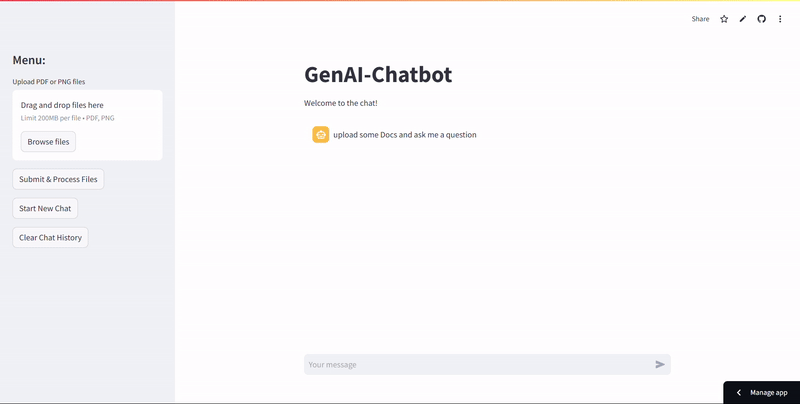

## GenAI-Chatbot
Chat with the Document

GenAI-Chatbot is a Streamlit-based application that allows users to upload PDF and PNG files, process the text content, and interact with a generative AI model to ask questions about the uploaded documents.

## Features

- **Upload PDF and PNG files**: Users can upload multiple PDF and PNG files.
- **Text Extraction**: Extracts text from PDF files and images using PyPDF2 and pytesseract.
- **Text Chunking**: Splits extracted text into manageable chunks using `RecursiveCharacterTextSplitter`.
- **Vector Store**: Stores text chunks as vectors using `FAISS` and `GoogleGenerativeAIEmbeddings`.
- **Conversational AI**: Uses `ChatGoogleGenerativeAI` to answer questions based on the uploaded documents.
- **Clear Chat**: Allows users to clear the chat history and reset the context.

<h3> Tech Stack Used  </h3>
<p align="left">
  <a href="https://www.python.org/" target="_blank">
    
  </a>
  <a href="https://developers.google.com/generative-ai" target="_blank">
    
  </a>
  <a href="https://streamlit.io/" target="_blank">
    
  </a>
</p>

## Dependencies

- [Streamlit](https://streamlit.io/)
- [PyPDF2](https://pypdf2.readthedocs.io/)
- [pytesseract](https://github.com/madmaze/pytesseract)
- [FAISS](https://github.com/facebookresearch/faiss)
- [Google Generative AI](https://developers.google.com/generative-ai)
- `langchain_google_genai`
- `langchain`
- `Pillow`
- `python-dotenv`

### Preview


=======

## Local Development

  ### Creae Virtual Environment

   ```bash
   pip install virtualenv
   python -m venv env
   ```
   #### Activate the Virtual Environment
  In CMD
   ```bash
   .\env\Scripts\activate.bat
   ```

1. **Install Dependencies:**

   ```bash
   pip install -r requirements.txt
   ```
  Using pytesseract
  - Ubuntu
    `sudo-apt install tesseract-ocr`
   ```
    pytesseract.pytesseract.tesseract_cmd = r'/usr/bin/tesseract'
   ```
  - Windows
    - [Download](https://github.com/tesseract-ocr/tesseract/releases/)
    - Set Environment Variable &rarr; System Variable &rarr; Path &rarr; `C:\Program Files\Tesseract-OCR`

2. **Set up Google API Key:**
   - You can get Google Api key [from Here](https://aistudio.google.com/app/apikey) </br>
   Get API key -> Generative Language Client -> Create API key in existing project.
   - Obtain a Google API key and set it in the `.env` file.

   ```bash
   GOOGLE_API_KEY=your_api_key_here
   ```

3. **Run the Application:**

   ```bash
   streamlit run app.py
   ```
